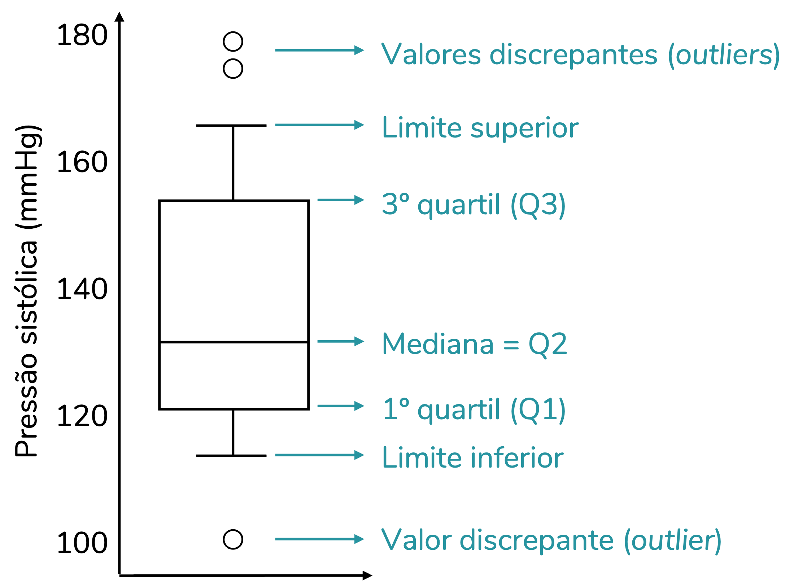

```{r setup, include=FALSE}
knitr::opts_chunk$set(echo = TRUE)
```

No exercício anterior criamos o primeiro gráfico com a biblioteca **ggplot2**, aqui vamos explorar a diversidade de gráficos e como cada um tem uma função diferente na hora de interpretar os dados.

Bibliotecas
```{r message=FALSE}
library(readr)
library(dplyr)
library(tidyr)
library(ggplot2)
```

## Importando dados para o exercício

Para esse exercício, a plataforma dataquest adaptou a base de dados para simplificar e focar no tema que é a diversidade de gráficos. Aqui vai ser necessário trabalhar esses dados para se aproximar do resultado do exercício na plataforma.

A ideia é analisar os dados [**deste site**](https://github.com/fivethirtyeight/data/tree/master/fandango) onde foi compilado as notas que usuários deram para cerca de 146 filmes em 2015 em 4 plataformas diferentes:

* Rotten Tomatoes
* Metacritic
* IMDB
* Fandango

No mesmo site é possível visualizar o dicionário dos dados em detalhes. Aqui vamos simplificar essa base para focar nas visualizações.

Importando a base completa

```{r}
dataset <- read_csv(paste0("https://raw.githubusercontent.com/fivethirtyeight/",
                            "data/master/fandango/fandango_score_comparison.csv"))

glimpse(dataset)
```

Selecionando colunas de interesse

```{r}
dataset_filtered <- dataset %>% select(FILM, Fandango_Ratingvalue, RT_norm, 
                                       Metacritic_norm, IMDB_norm)
```

**Utilizando Pivot**

Como a base original tem uma coluna para a avaliação/nota do filme por coluna, e no exercício da plataforma estava por linha, é necessário "tombar" esses dados das colunas para a linha. Assim ao invés de ter registros únicos com 4 colunas de notas, teremos 4 linhas por filme, cada linha com a nota de um site diferente.
Essa alteração na disposição dos dados de colunas para linhas e vice-versa é possível através das funções ```pivot_wider``` e, nesse caso em específico, ```pivot_longer```.

**Antes**

```{r}
dataset_filtered %>% head()
```

**Depois**

```{r}
pivot <- dataset_filtered %>% 
  pivot_longer(!FILM,                    #colunas a serem pivotadas
               names_to = "Rating_Site", #coluna onde vai nomes das colunas
               values_to = "Rating" )    #coluna onde vai os valores das colunas
pivot
```

Fazendo um de-para para ter um nome mais intuitivo que represente cada site.

```{r}
pivot <- pivot %>% 
  mutate(Rating_Site = 
           case_when(Rating_Site == "Fandango_Ratingvalue"  ~ "Fandango",
                     Rating_Site == "RT_norm"               ~ "Rotten_Tomatoes",
                     Rating_Site == "Metacritic_norm"       ~ "Metacritic",
                     Rating_Site == "IMDB_norm"             ~ "IMDB",
                     TRUE ~ Rating_Site))
pivot$Rating_Site %>% table()
```

Por fim, para ter uma ideia geral das notas para cada site e compara-los de uma forma simples, calculamos a média por site.

```{r}
medias <- pivot %>% 
            group_by(Rating_Site) %>% 
            summarise(Avg = mean(Rating))
medias
```

Agora entramos na parte visual do exercício.

## Gráfico de Barras (geom_col)

Temos médias para cada site e podemos colocar num gráfico para comparar de forma visual. Assim somente de "bater o olho" já conseguimos perceber melhor quem tem notas mais altas ou mais baixas sem mentalmente ficar calculando e percorrendo os olhos por todo dataset.

Nós já aprendemos a utilizar um gráfico de linha, mas ele traz uma ideia de continuidade, é bom para comparar algo constante, como uma variação ao longo do tempo, por exemplo. Nesse caso queremos comparar diferentes grupos e não faz sentido ter uma linha conectando as informações. O ideal é um gráfico de barras.

```{r}
pivot %>% 
  ggplot(aes(x=Rating_Site, y=Rating))+
  geom_col()
```

## Gráfico de Barras de Frequência (geom_bar)

Você deve ter estranhado um gráfico de barras se chamar col (colunas) ao invés de bar (barras). Temos a função ```geom_bar``` e é possível criar um gráfico de barras também, mas não é tão simples quanto utilizando a função ```geom_col```. Aqui usando o ```geom_bar```, apenas informamos o eixo x e automaticamente o eixo y vai utilizar a frequencia com que o eixo x aparece na base assim criando um gráfico de frequência. Como temos 4 notas exatas para os 146 filmes, esse gráfico não vai ser muito útil nesse caso, visto que todas entidades terão o mesmo valor (a não ser que o objetivo do gráfico seja conferir exatamente isso).

```{r}
pivot %>% 
  ggplot(aes(x=Rating_Site))+
  geom_bar()

```


## Histograma (geom_histogram)

Até aqui já sabemos que na base temos a mesma quantidade de filmes para os 4 sites e é justo compara-los, e através da média temos uma noção de quem dá notas mais altas (Fandango) ou mais baixas (Metacritic). Mas será mesmo que podemos assumir isso só olhando a média?

A média é um valor facilmente influenciado, pode ser um conjunto de notas muito altas e muito baixas, ou um conjunto de notas medianas.

Por exemplo, ambos casos abaixo tem a média 5:

```{r}
mean(c(5,5,5,5,5,4,5,5,6,5))
mean(c(5,0,9,1,2,8,4,9,5,7))

```
Conseguimos ver que apesar de a média ser a mesma em ambos casos, a variação/distribuição dos dados é diferente. E pensando de forma visual o gráfico que visa checar a distribuição dos dados é o histograma.

```{r}
pivot %>% 
  ggplot(aes(x=Rating))+
  geom_histogram(bins=20)
```

O **bin** é o "bloco", então se informamos 10 bins, queremos que o gráfico tenha 10 blocos, 10 barras.
As barras ficam coladas umas nas outras para passar essa ideia de continuidade, pois diferente do gráfico de barras onde comparamos entidades distintas, aqui estamos olhando a distribuição de uma mesma informação.

Ao invés de informar a quantidade de bins, uma alternativa é informar qual o tamanho da variação que pode conter dentro de cada bin (**binwidth**), e assim ele mesmo calcular a quantidade de bins para chegar no intervalo desejado.

```{r}
pivot %>% 
  ggplot(aes(x=Rating))+
  geom_histogram(binwidth=0.5)
```


### Múltiplos Gráficos numa só visualização

O último gráfico ajudou a enxergar a dispersão dos dados, no entanto queremos comparar essa variação para cada site e até então só visualizamos a distribuição geral.

Poderíamos filtrar cada site para enxergar essa distribuição separadamente:

```{r}
pivot %>% 
  filter(Rating_Site == "Fandango") %>%
  ggplot(aes(x=Rating))+
  geom_histogram(bins=20)
```

Mas um jeito mais eficaz de comparar é ter todas as informações necessárias em um único gráfico.

```{r}
pivot %>% 
  ggplot(aes(x=Rating, color=Rating_Site))+
  geom_histogram(bins=20)
```

Ou se preferir ao invés da barra contornada, a barra totalmente colorida para diferenciar a informação de cada site:

```{r}
pivot %>% 
  ggplot(aes(x=Rating, fill=Rating_Site))+
  geom_histogram(bins=20)
```

Em ambos gráficos notamos que os sites IMDB e Fandangos de fato tem maior concentração nas notas 4, enquanto o Metacritic e Rotten Tomatoes ficam mais distribuídos.

## Gráfico de Densidade (geom_density)

As vezes os bins do histograma nos limita, os valores podem variar em casas decimais e fica difícil dividir isso em blocos. Uma alternativa a esse problema é o gráfico de densidade, que traz uma linha para representar a distribuição dos dados:

```{r}
pivot %>% 
  ggplot(aes(x=Rating, fill=Rating_Site))+
  geom_density()
```

## Boxplot (geom_boxplot)

Os gráficos que mostram a distribuição demonstraram ser grandes aliados para interpretar o dataset. Mas podemos ainda melhorar a forma como comunicamos os dados dessa base visualmente. E se além de olhar a distribuição quisessemos num único gráfico também ter informações como mediana, mínimo e máximo? Em outras palavras métricas que nos ajudam a descrever essa base.

Aqui entra o boxplot, um gráfico num primeiro momento estranho por ser diferente, conter muita informação. Mas para quem trabalha com dados é ótimo por conter informações importantes todas consolidadas e de bater o olho podemos interpretar muitos dados de uma só vez.

É possível visualizar:

* Outliers
* Mínimo
* Máximo
* Mediana
* Quarters
* Distribuição

Aqui ainda é possível ver a concentração de notas em torno de 4 para o Fandango e IMDB, enquanto os demais estão mais distribuidos.

```{r}
pivot %>% 
  ggplot(aes(x=Rating_Site, y=Rating)) +
  geom_boxplot()
```

Aqui segue uma visualização que explica melhor as informações que encontramos em um boxplot (A imagem por ser encontrada [aqui](https://fernandafperes.com.br/blog/interpretacao-boxplot/)):

```{r}

# #Imagem como anexo ao final do arquivo (fora do chunk)
```


### Factors

Conseguimos criar visualizções muito úteis para interpretar os dados, tudo de forma simples. Mas é claro que uma vez criado o gráfico podemos melhora-lo visando uma transmissão desse conhecimento de forma mais clara e objetiva, facilitando ainda mais a interpretação.

Um ponto que pode contribuir é a ordenação dos sites, e se quisermos mudar a ordem com que eles aparecem no gráfico? Aqui que o tipo de dado factor pode ajudar.

```{r}
pivot <- pivot %>% 
  mutate(Rating_Site = factor(Rating_Site))

pivot %>% head()
```

Até então nada parece ter mudado. Aos nossos olhos ainda é uma simples string, mas o importante é a forma com que o R lida com os factors, ele entende como um número. No exemplo abaixo o R considera o Fandango como número 1.

```{r}
pivot %>% pull(Rating_Site) %>% levels()
```

Podemos escolher a nossa própria ordem, aqui o primeiro lugar é do Rotten Tomatoes.

```{r}
pivot <- pivot %>% 
  mutate(Rating_Site = factor(Rating_Site,
                              levels = c("Rotten_Tomatoes", "Metacritic", 
                                         "IMDB", "Fandango")))
pivot %>% pull(Rating_Site) %>% levels()
```

Agora se refizermos nosso boxplot, a ordem obedecerá os factors.

```{r}
pivot %>% 
  ggplot(aes(x=Rating_Site, y=Rating)) +
  geom_boxplot()
```

