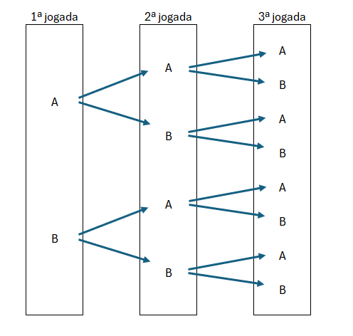

```{r setup, include=FALSE}
knitr::opts_chunk$set(echo = TRUE)

library(readr)
library(dplyr)
library(glue)

options(scipen=999)
```

## Probabilidades de Eventos Mutuamente Exclusivos

Até aqui lidamos com exemplos simples com espaço amostral relativamente pequeno para efeitos de aprendizado.
Pensando no exemplo da moeda, pensando num espaço amostral onde a pessoa jogou 2 vezes a moeda, temos a seguindo combinação:

- Combinação 1: Cara e Cara
- Combinação 2: Cara e Coroa
- Combinação 3: Coroa e Cara
- Combinação 4: Coroa e Coroa

Representando em letras:

$$\Omega = {AA,AB,BA,BB}$$


Mas e se o nosso espaço amostral é composto por 100 elementos? Se torna um pouco cansativo escrever todos os elementos.
Para calcular uma probabilidade precisamos saber 2 coisas:

- o tamanho do espaço amostral
- todos resultados que satisfaçam o evento

E quando há muitos resultados, não podemos mais simplesmente contar de cabeça.

E se mudarmos a perspectiva, ao invés de olhar para 100 elementos de um grande experimento, considerarmos cada experimento individualmente num formato de árvore.



A cada jogada formamos uma árvore, e dependendo da quantidade de jogadas sabemos até que caminho dessa árvore percorrer.
Assim conseguimos saber o espaço amostral pelo número de caminhos da árvore.

Por exemplo, na primeira jogada, imagine que caiu "cara" (A), isso sabemos que representa 50% de chance de acontecer. Agora se olharmos duas jogadas seguidas que nas duas caiu "cara" (A -> A) isso representa 25% de probabilidade.


Na segunda jogada também só era possível cara ou coroa, 50% de chance para cada resultado, no entanto não podemos esquecer da primeira jogada e levar em consideração a probabilidade dessa primeira jogada.

É aqui que entra a **Regra de Multiplicação**

$$(P\ cara\ 2\ vezes) = P(cara\ jogada\ 1)\ X\ P(cara\ jogada\ 2)$$


$$(P\ cara\ 2\ vezes) = \frac{1}{2} * \frac{1}{2} = \frac{1}{4} = 25\%$$
$$P(A∩B)=P(A)*P(B)$$
Já temos a fórmula, a diferença é que precisamos replicar para 100 jogadas:

$$P(100\ caras) = \frac{1}{2} * ... * \frac{1}{2} = (\frac{1}{2})^{100}$$

A regra da multiplicação é útil para descobrir a probabilidade de uma intersecção na regra de adição geral (onde os eventos não são mutuamente exclusivos)

Recapitulando a fórmula:

$$P (C\cup D) = P(C) + P(D) - P(C\cap D)$$
No caso poderíamos representar da seguinte maneira:
$$P (C\cup D) = P(C) + P(D) - P(C * D)$$
Pense num exemplo de jogar dado de 6 lados.
Temos duas combinações de eventos:

- C = {1,2,3}
- D = {2,3,4,5}

Em duas jogadas queremos saber a probabilidade de cair no evento C **OU** D, ou seja a união. Aqui sabemos exatamente os elementos e conseguiríamos montar as frações facilmente.
C tem a probabilidade 3/6 que é 50%, e D tem a probabilidade 4/6 que é 66,7%.
Mas se tivéssemos apenas o resultado das frações e não tivéssemos os detalhes dos elementos de cada evento, não seria possível chegar nessa resposta, apenas usando a regra da multiplicação.

C tem a probabilidade 0.5 e D ~0.667, nesse caso o cálculo seria:

$$P (C\cup D) = 0.5 + 0.667 - (0.5 * 0.667) = 0.833$$
Da mesma forma se calcularmos através das frações chegamos no mesmo resultado

$$P (C\cup D) = \frac{3}{6} + \frac{4}{6} - \frac{2}{6} = 0.833$$


## Eventos Independentes

Ao jogar uma moeda duas vezes seguidas, não há motivos para acreditar que o resultado da primeira jogada possa influenciar a segunda jogada. Sendo assim a probabilidade de cada jogada isoladamente permanece 50%, e chamados de **Eventos Independentes**.

No entanto podem existir situações onde o resultado de um evento impacta o evento seguinte, nesse caso chamamos de **Eventos Dependentes**.

Entender isso é importante, pois a regra da multiplicação que vimos acima assume que os eventos são **independentes**.


**Eventos Independentes vs Mutuamente Exclusivos**

Esses conceitos podem gerar confusão, mas são completamente diferentes. Uma coisa é um evento não ser afetado por outro, e outra coisa é eventos não terem intersecção de resultados.

Eventos Independentes:

$$P(A∩B)=P(A)×P(B)$$

Mutuamente Exclusivos:

$$P(A∩B)=0$$
A interpretação pode ser feita equivocadamente da seguinte maneira "se A acontece, B não tem chances de acontecer e por isso A está afetando B", mas na verdade o acontecimento de A, não diminui a probabilidade de B acontecer na próxima vez.

## Complemento

Nós costumamos representar um evento por um círculo (Diagrama de Venn) e nele está contido todos resultados que satisfação àquele evento. E os resultados que não atendem o evento? eles ficam "fora" do círculo no retangulo que representa o espaço amostral, e os chamamos de **complemento**. Se chamamos um evento de A, seu complemento  vai ter uma letra C maiúscula $A^C$.

Imagine uma situação onde em 4 jogadas de um dado de 6 lados, queremos pelo menos uma vez que o 6 seja o resultado. Isso é diferente do que vimos até aqui que seria uma vez o 6 em todas as jogadas. Ao invés de olhar para apenas um 6, podemos olhar o complemento que seria nenhum 6.

Sabemos que o espaço amostral é composto pelo evento e seu complemento

$$A \cup A^C = \Omega$$

Um resultado pode **ou** satisfazer o evento **ou** não e ser o complemento, não tem como fazer parte dos 2, então são mutuamente exclusivos. Sendo assim a união de ambos é a soma de suas probabilidades.

$$P(A \cup A^C) = P(\Omega)$$

$$P(A) +  P(A^C) = P(\Omega)$$

Se a probabilidade do espaço amostral é 100% então representamos por 1

$$P(A) +  P(A^C) = 1$$
Movendo o complemento para o outro lado da equação invertemos o sinal.
$$P(A) = 1 - P(A^C)$$
Se a probabilidade de jogar um 6 é 1/6, a probabilidade de não joga-lo é de 5/6.
Então a probabilidade de em todas as 4 jogadas não ter um 6 é

$$P(A^C) = \frac{5}{6}^4= 0.4823$$


Sendo assim voltando na fórmula anterior
$$P(A) = 1 - 0.4823 = 0.5177$$


Dessa forma, mudando apenas a perspectiva do problema conseguimos solucionar de maneira mais fácil.

